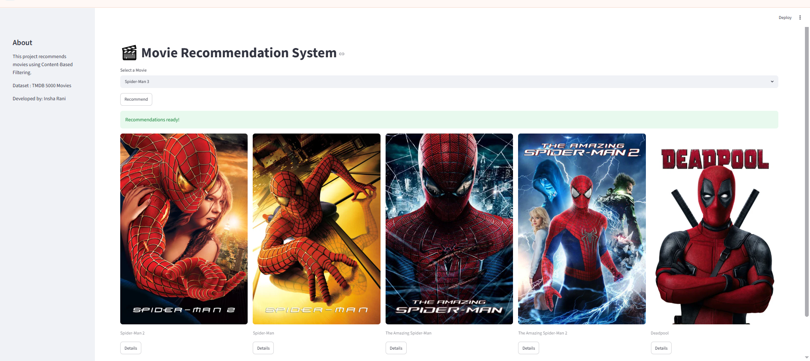
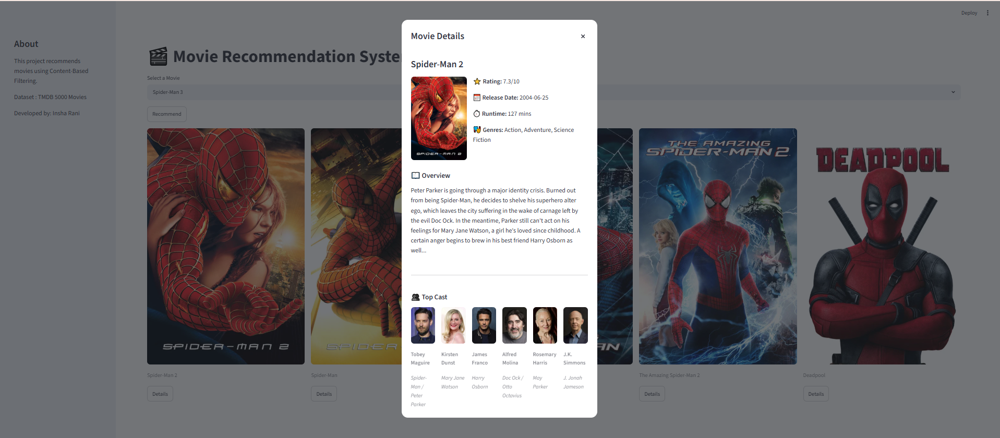

# 🎬 Movie Recommendation System


A content-based movie recommendation system built with Python and Streamlit. 
The application recommends similar movies based on movie features and uses the TMDB API to fetch movie posters, details, ratings, genres, and cast information.

## 🚀 Live Demo

[Click here to view the live application](YOUR_STREAMLIT_APP_LINK)

## 📌 Project Overview

This project is a content-based movie recommendation system that suggests movies similar to the movie selected by the user.

The recommendation engine uses a precomputed similarity matrix to identify movies with similar features. TMDB API is integrated to dynamically fetch movie information and posters.

## ✨ Features

- 🎬 Movie recommendation based on content similarity
- 🖼️ Dynamic movie poster fetching using TMDB API
- ⭐ Movie ratings
- 📅 Release date
- ⏱️ Runtime
- 🎭 Movie genres
- 👥 Top cast information
- 📖 Movie overview
- 💬 Interactive movie details popup
- ⚡ Streamlit-based interactive interface

## 🛠️ Tech Stack

- Python
- Streamlit
- Pandas
- NumPy
- Scikit-learn
- Requests
- TMDB API
- Pickle

## 📂 Project Structure

```text
Movie-Recommendation-System/
│
├── app.py
├── requirements.txt
├── README.md
├── .gitignore
├── .env
│
├── data/
│   ├── movie_dict.pkl
│   ├── similarity.pkl
│   └── tmdb_5000_movies.csv
│
├── notebooks/
│   └── main.ipynb
│
├── utils/
│   ├── api.py
│   ├── recommender.py
│   └── popup.py
│
├── images/
│   ├── home.png
│   ├── recommendations.png
│   └── movie-details.png
│
└── assets/
🖥️ Application Screenshots
Home Page


Movie Recommendations


Movie Details


⚙️ Installation
1. Clone the repository
git clone YOUR_GITHUB_REPOSITORY_URL
2. Navigate to the project directory
cd Movie-Recommendation-System
3. Create and activate the virtual environment
conda activate ds_basics
4. Install dependencies
pip install -r requirements.txt
5. Configure TMDB API

Create a .env file in the project root:

API_KEY=your_tmdb_api_key
6. Run the application
streamlit run app.py
🔑 API

This project uses the TMDB API to retrieve movie posters, movie details and cast information.

The API key is stored in an environment variable and is not included directly in the source code.

🧠 Recommendation Approach

The application uses a content-based recommendation approach.

A similarity matrix is used to calculate similarity between movies and return the top five movies most similar to the selected movie.

🔮 Future Improvements
Movie trailer integration
Genre-based filtering
Search functionality
Favorites/watchlist feature
Trending movies section
Improved recommendation algorithm
User-based recommendations
👩‍💻 Author

Insha Rani

Data Science Enthusiast

⭐ If you found this project useful, consider giving it a star!